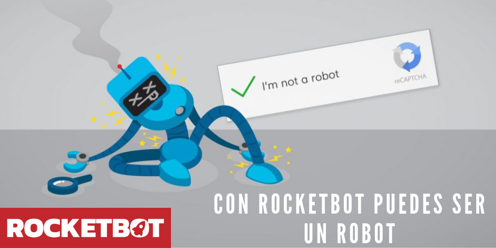

# 2Captcha
  
Módulos para resolver recatpchas con 2Captcha  
  

## Como instalar este módulo
  
__Descarga__ e __instala__ el contenido en la carpeta 'modules' en la ruta de rocketbot.  

## Como usar este módulo
Para usar este módulo, tienes que tener una cuenta en 2Captcha con créditos. También, si 
deseas ver la tabla con datos adicionales, tienes que tener abierta la página del captcha con un navegador controlado 
por Rocketbot.

## Descripción de los comandos

### Resolver ReCaptcha
  
Resuelve ReCaptcha con API de https://2captcha.com mas información https://2captcha.com/2captcha-
api#solving_recaptchav2_new
|Parámetros|Descripción|ejemplo|
| --- | --- | --- |
|Datos importantes|||
|Key 2Captcha|Key provista por 2Captcha|Key|
|Url de la página que tiene ReCaptcha | pageurl|Key provista por 2Captcha|Url de la página|
|Token ReCaptcha | sitekey||Token|
|Variable donde se almacena el resultado de 2Captcha|Variable donde guardar el resultado|Variable|

### Resolver Captcha Imagen
  
Resuelve un Captcha tipo imagen con API de https://2captcha.com mas información https://2captcha.com/2captcha-api
|Parámetros|Descripción|ejemplo|
| --- | --- | --- |
|Key 2Captcha|Key provista por 2Captcha|Key|
|Ruta a la imagen en su equipo|Ruta donde se encuentra la imagen del captcha|C:/Users/User/Desktop/captcha.png|
|Variable donde se almacena el resultado de 2Captcha|Variable donde guardar el resultado|Variable|

