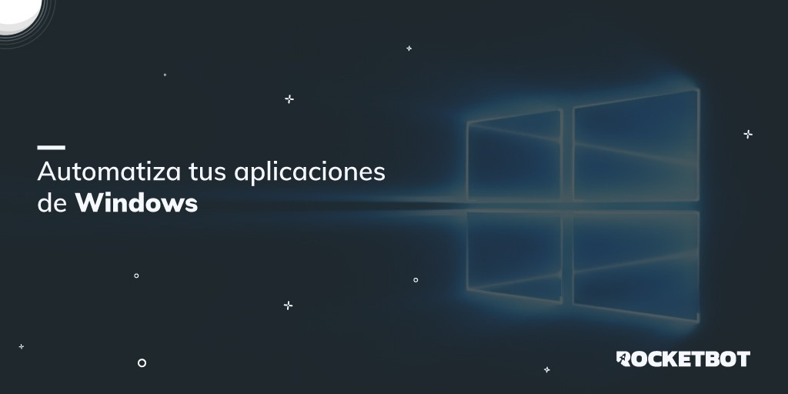

# MS Windows Controls
  
Módulo para controlar aplicaciones de MS Windows  

Este módulo puede utilizarse con "Desktop Recorder"

*Read this in other languages: [English](Manual_WindowsControl.md), [Portugues](Manual_WindowsControl.pr.md), [Español](Manual_WindowsControl.es.md).*
  

## Como instalar este módulo
  
__Descarga__ e __instala__ el contenido en la carpeta 'modules' en la ruta de Rocketbot.  

## Descripción de los comandos

### Conectar Ventana
  
Se conecta a una ventana ya abierta y realiza múltiples acciones dentro de ella. Esta actividad también se genera automáticamente cuando se utiliza la grabadora de escritorio.
|Parámetros|Descripción|ejemplo|
| --- | --- | --- |
|Selector|Utilizar selector obtenido en DesktopRecorder. Este selector es una propiedad de texto utilizada para encontrar un elemento de UI particular cuando se ejecuta la actividad. En realidad, es un fragmento XML o JSON que especifica los atributos del elemento de GUI que está buscando y de algunos de sus padres.|<wnd app='calc.exe' cls='CalcFrame' title='Calculadora' />|
|Tiempo de Espera en Segundos|Tiempo de espera en segundos antes de que se genere el error|30|
|Resultado|Variable donde se almacenará el resultado|resultado|

### Captura de pantalla del elemento
  
Realiza una captura de pantalla del elemento y la guarda en el directorio especificado.
|Parámetros|Descripción|ejemplo|
| --- | --- | --- |
|Selector|Utilizar selector obtenido en DesktopRecorder. Este selector es una propiedad de texto utilizada para encontrar un elemento de UI particular cuando se ejecuta la actividad. En realidad, es un fragmento XML o JSON que especifica los atributos del elemento de GUI que está buscando y de algunos de sus padres.|<wnd app='calc.exe' cls='CalcFrame' title='Calculadora' />|
|Ruta de la captura|Seleccione el nombre y la ubicación donde se guardará la captura de pantalla tomada.|C:/Users/Usuario/Desktop/Captura|

### Click
  
Hace clic en un elemento UI especificado.
|Parámetros|Descripción|ejemplo|
| --- | --- | --- |
|Selector|Utilizar selector obtenido en DesktopRecorder. Este selector es una propiedad de texto utilizada para encontrar un elemento de UI particular cuando se ejecuta la actividad. En realidad, es un fragmento XML o JSON que especifica los atributos del elemento de GUI que está buscando y de algunos de sus padres.|<wnd app='calc.exe' cls='CalcFrame' title='Calculadora' />|
|Tipo de Click|Especifica el tipo de clic del mouse (simple, doble, arriba, abajo) que se usa al simular el evento de clic. Por defecto, se selecciona un solo clic.|CLICK_SIMPLE|
|Botón de Mouse|El botón del mouse (izquierdo, derecho, medio) utilizado para la acción de clic. Por defecto, el botón izquierdo del ratón está seleccionado.|BTN_IZQUIERDO|
|Simular Click|Si se selecciona, simula el clic utilizando la tecnología de la aplicación de destino. Este método de entrada es el más rápido y funciona en segundo plano. De forma predeterminada, esta casilla de verificación no está seleccionada. El método predeterminado es el más lento, no puede funcionar en segundo plano, pero es compatible con todas las aplicaciones de escritorio.|False|
|Resultado|Variable donde se almacenará el resultado|resultado|

### Click relativo
  
Hace click con coordenadas relativas a un elemento UI especificado.
|Parámetros|Descripción|ejemplo|
| --- | --- | --- |
|Selector|Utilizar selector obtenido en DesktopRecorder. Este selector es una propiedad de texto utilizada para encontrar un elemento de UI particular cuando se ejecuta la actividad. En realidad, es un fragmento XML o JSON que especifica los atributos del elemento de GUI que está buscando y de algunos de sus padres.|<wnd app='calc.exe' cls='CalcFrame' title='Calculadora' />|
|Coordenada X|Coordenada X para donde se moverá relativamente el mouse antes de realizar el click, desde la ubicación del selector.|150|
|Coordenada Y|Coordenada Y para donde se moverá relativamente el mouse antes de realizar el click, desde la ubicación del selector.|100|

### Obtener Texto
  
Extrae un valor de texto de un elemento de UI especificado.
|Parámetros|Descripción|ejemplo|
| --- | --- | --- |
|Selector|Utilizar selector obtenido en DesktopRecorder. Este selector es una propiedad de texto utilizada para encontrar un elemento de UI particular cuando se ejecuta la actividad. En realidad, es un fragmento XML o JSON que especifica los atributos del elemento de GUI que está buscando y de algunos de sus padres.|<wnd app='calc.exe' cls='CalcFrame' title='Calculadora' />|
|Resultado|Variable donde se almacena el resultado|resultado|

### Enviar Texto
  
Le permite escribir una cadena en el atributo Texto de un elemento de UI especificado.
|Parámetros|Descripción|ejemplo|
| --- | --- | --- |
|Selector|Utilizar selector obtenido en DesktopRecorder. Este selector es una propiedad de texto utilizada para encontrar un elemento de UI particular cuando se ejecuta la actividad. En realidad, es un fragmento XML o JSON que especifica los atributos del elemento de GUI que está buscando y de algunos de sus padres.|<wnd app='calc.exe' cls='CalcFrame' title='Calculadora' />|
|Limpiar|Si se selecciona, elimina el texto anterior para escribir uno nuevo. Por defecto, el texto se escribirá en una nueva línea.|True|
|Texto|Texto o variable que se vá a escribir en el atributo Text del objeto.|Texto|
|Resultado|Variable donde se almacena el resultado|resultado|

### Enviar Tecla
  
Le permite escribir una cadena en el atributo Texto de un elemento de UI especificado.
|Parámetros|Descripción|ejemplo|
| --- | --- | --- |
|Selector|Utilizar selector obtenido en DesktopRecorder. Este selector es una propiedad de texto utilizada para encontrar un elemento de UI particular cuando se ejecuta la actividad. En realidad, es un fragmento XML o JSON que especifica los atributos del elemento de GUI que está buscando y de algunos de sus padres.|<wnd app='calc.exe' cls='CalcFrame' title='Calculadora' />|
|Texto|Texto o variable que se vá a escribir en el atributo Text del objeto.|Texto|
|Agregar delay|Activar si la aplicación escribe lento|False|
|Resultado|Variable donde se almacena el resultado|resultado|

### ComboBox
  
Seleccione un item desde un Selector o lista de items.
|Parámetros|Descripción|ejemplo|
| --- | --- | --- |
|Selector|Utilizar selector obtenido en DesktopRecorder. Este selector es una propiedad de texto utilizada para encontrar un elemento de UI particular cuando se ejecuta la actividad. En realidad, es un fragmento XML o JSON que especifica los atributos del elemento de GUI que está buscando y de algunos de sus padres.|<wnd app='calc.exe' cls='CalcFrame' title='Calculadora' />|
|Item|Escriba el nombre del item a seleccionar dentro del Selector o Lista.|Item|
|Resultado|Variable donde se almacena el resultado|resultado|

### Wheel
  
Simula movimiento de la rueda del mouse
|Parámetros|Descripción|ejemplo|
| --- | --- | --- |
|Selector|Utilizar selector obtenido en DesktopRecorder. Este selector es una propiedad de texto utilizada para encontrar un elemento de UI particular cuando se ejecuta la actividad. En realidad, es un fragmento XML o JSON que especifica los atributos del elemento de GUI que está buscando y de algunos de sus padres.|<wnd app='calc.exe' cls='CalcFrame' title='Calculadora' />|
|Vueltas|Vueltas que dará la rueda del mouse|1|
|Up or Down|Seleccionar si el movimiento de la rueda será para arriba o abajo.|up|
|Resultado|Variable donde se almacena el resultado|resultado|

### Extraer tabla
  
Extrae el valor de las celdas de una tabla de un elemento de UI especificado.
|Parámetros|Descripción|ejemplo|
| --- | --- | --- |
|Selector|Utilizar selector obtenido en DesktopRecorder. Este selector es una propiedad de texto utilizada para encontrar un elemento de UI particular cuando se ejecuta la actividad. En realidad, es un fragmento XML o JSON que especifica los atributos del elemento de GUI que está buscando y de algunos de sus padres.|<wnd app='calc.exe' cls='CalcFrame' title='Calculadora' />|
|Fila|Fila que será extraída|2|
|Columna|Columna que será extraída|3|
|Resultado|Variable donde se almacena el resultado|resultado|

### Esperar objeto
  
Espera la aparición de un objeto en pantalla
|Parámetros|Descripción|ejemplo|
| --- | --- | --- |
|Selector|Selector a esperar|{"ctrlid":"NumberPad","cls":"NamedContainerAutomationPeer","title":"Teclado numérico","ctrltype":"GroupControl","idx": 7}|
|Tiempo de Espera en Segundos|Maximum waiting time for the selector|30|
|Acción a esperar|Acción a esperar|-----Select-----|
|Resultado|Variable donde se almacena el resultado|resultado|

### Obtener Handle de ventanas abiertas
  
Devuelve una lista con tuplas que contienen el nombre y handle de las ventanas abiertas
|Parámetros|Descripción|ejemplo|
| --- | --- | --- |
|Filtro|Filtro para buscar el handle|*Block de notas|
|Variable|Variable donde se guardará el handle|Variable|

### Leer Lista
  
Extrae el valor de las celdas de una lista de un elemento de UI especificado.
|Parámetros|Descripción|ejemplo|
| --- | --- | --- |
|Selector|Propiedad de texto utilizada para encontrar un elemento de UI particular cuando se ejecuta la actividad. En realidad, es un fragmento XML o JSON que especifica los atributos del elemento de GUI que está buscando y de algunos de sus padres.|{"ctrlid":"NumberPad","cls":"NamedContainerAutomationPeer","title":"Teclado numérico","ctrltype":"GroupControl","idx": 7}|
|Resultado|Variable donde se almacena el resultado|resultado|

### Encontrar selector hijo por
  
Busca todos los hijos por alguna propiedad y retorna sus selectores.
|Parámetros|Descripción|ejemplo|
| --- | --- | --- |
|Selector|Propiedad de texto utilizada para encontrar un elemento de UI particular cuando se ejecuta la actividad. En realidad, es un fragmento XML o JSON que especifica los atributos del elemento de GUI que está buscando y de algunos de sus padres.|{"ctrlid":"NumberPad","cls":"NamedContainerAutomationPeer","title":"Teclado numérico","ctrltype":"GroupControl","idx": 7}|
|Data a buscar|Dato hijo a buscar|labelClass1|
|Buscar por|Seleccion de dónde buscar el selector hijo|ctrlid|
|Resultado|Variable donde se almacena el resultado|resultado|

### Obtener estado de checkbox
  
Obtiene el Default Action de un checkbox.
|Parámetros|Descripción|ejemplo|
| --- | --- | --- |
|Selector|Propiedad de texto utilizada para encontrar un elemento de UI particular cuando se ejecuta la actividad. En realidad, es un fragmento XML o JSON que especifica los atributos del elemento de GUI que está buscando y de algunos de sus padres.|{"ctrlid":"NumberPad","cls":"NamedContainerAutomationPeer","title":"Teclado numérico","ctrltype":"GroupControl","idx": 7}|
|Obtener Valor|Checkbox para marcar solo si la opción por defecto no funciona correctamente|False|
|Resultado|Variable donde se almacena el resultado|resultado|

### Objeto habilitado
  
Retorna verdadero o falso si el objeto está habilitado
|Parámetros|Descripción|ejemplo|
| --- | --- | --- |
|Selector|Propiedad de texto utilizada para encontrar un elemento de UI particular cuando se ejecuta la actividad. En realidad, es un fragmento XML o JSON que especifica los atributos del elemento de GUI que está buscando y de algunos de sus padres.|{"ctrlid":"NumberPad","cls":"NamedContainerAutomationPeer","title":"Teclado numérico","ctrltype":"GroupControl","idx": 7}|
|Resultado|Variable donde se almacena el resultado|resultado|

### Agarrar y soltar
  
Arrastra y suelta un objeto desde coordenadas o el selector del objeto, tanto de origen como destino
|Parámetros|Descripción|ejemplo|
| --- | --- | --- |
|Puedes seleccionar la combinación de cualquiera de las opciones. Coordenadas y/o selector|||
|Selector de origen|Utilizar selector obtenido en DesktopRecorder. Este selector es una propiedad de texto utilizada para encontrar un elemento de UI particular cuando se ejecuta la actividad. En realidad, es un fragmento XML o JSON que especifica los atributos del elemento de GUI que está buscando y de algunos de sus padres.|<wnd app='calc.exe' cls='CalcFrame' title='Calculadora' />|
|Selector de destino|Utilizar selector obtenido en DesktopRecorder. Este selector es una propiedad de texto utilizada para encontrar un elemento de UI particular cuando se ejecuta la actividad. En realidad, es un fragmento XML o JSON que especifica los atributos del elemento de GUI que está buscando y de algunos de sus padres.|<wnd app='calc.exe' cls='CalcFrame' title='Calculadora' />|
|Coordenada de origen|Coordenadas desde donde se arrastrará|136,200|
|Coordenada de destino|Coordenadas hasta donde se arrastrará|500,200|
|Resultado|Variable donde se almacena el resultado|resultado|

### Obtener posición
  
Devuelve las coordenadas del elemento especificado. Puedes elegir mover el mouse a la posición
|Parámetros|Descripción|ejemplo|
| --- | --- | --- |
|Selector de origen|Utilizar selector obtenido en DesktopRecorder. Este selector es una propiedad de texto utilizada para encontrar un elemento de UI particular cuando se ejecuta la actividad. En realidad, es un fragmento XML o JSON que especifica los atributos del elemento de GUI que está buscando y de algunos de sus padres.|<wnd app='calc.exe' cls='CalcFrame' title='Calculadora' />|
|Mover mouse a la posición|Se se marca esta casilla, el mouse se moverá al centro del elemento antes de retornar la posición|True|
|Resultado|Variable donde se almacena el resultado|resultado|
