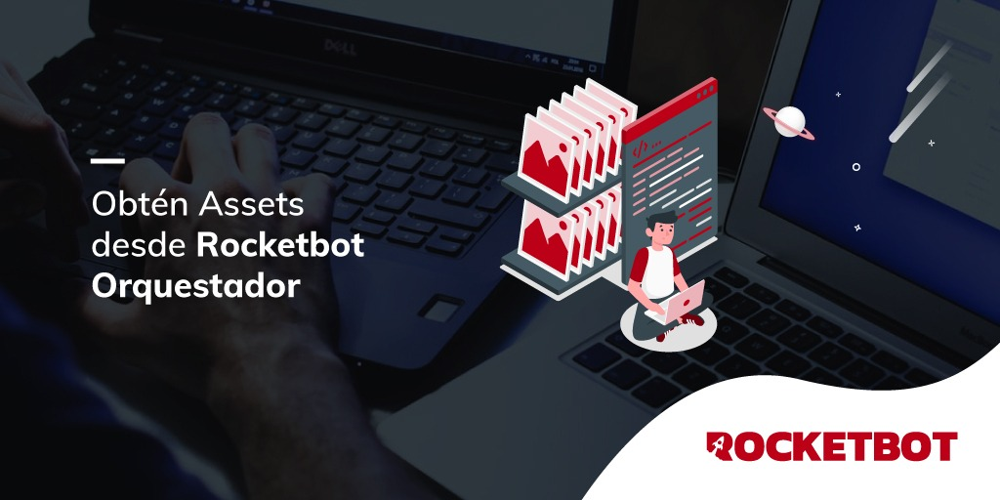

# Assets_NOC
  
Módulo para obtener asset de Rocketbot NOC  
  

## Como instalar este módulo
  
__Descarga__ e __instala__ el contenido en la carpeta 'modules' en la ruta de rocketbot.  

# Como usar este modulo

Debemos tener habilitado el uso del orquestador asi como el e-mail, contraseña, URL del servidor.

## Descripción de los comandos

### Login NOC
  
Inicie sesión en NOC utilizando e-mail o contraseña, clave API y archivo noc.ini.
|Parámetros|Descripción|ejemplo|
| --- | --- | --- |
|URL Servidor|URL del servidor a donde se conecta|https://roc.myrb.io/|
|Seleccione un metodo para conectarse al Orquestador|Opciones para iniciar sesión en R.O.C, se puede usar las credenciales del usuario, API Key o con el archivo noc.ini||
|Asignar resultado a Variable|Variable donde se almacenara el estado de la conexion, devuelve True si es exitosa o False en el caso contrario|Variable|

### Obtener Asset Específico
  
Obtiene el asset especifico que se le indique
|Parámetros|Descripción|ejemplo|
| --- | --- | --- |
|Nombre de Asset|Nombre del asset a obtener|Test|
|Token del proceso|Token del proceso|27FEXKIXFRFDUNVD|
|Guardar en Variable|Variable donde se guardara el resultado. Nombre de variable sin llaves {}|Variable|

### Obtener Todos los Assets
  
Obtiene todos los Assets y los asigna a las variables correspondientes
|Parámetros|Descripción|ejemplo|
| --- | --- | --- |
