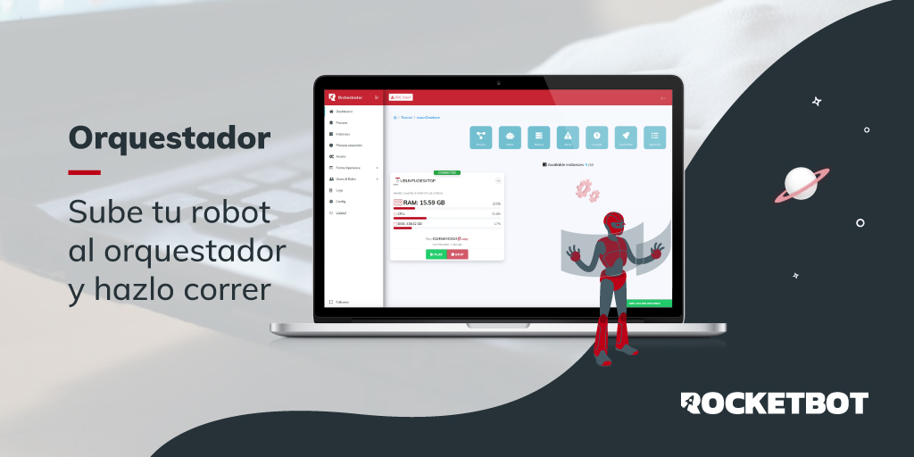

# Orchestrator Uploader
Addon to encrypt robot and upload to Orchestrator

> Deploy and manage your robot workforce at enterprise scale

## How to install this Addons?
**Download** and **uncompress** de content in “endpoints" forlder in Rocketbot installation path. **Reload** Rocketbot executable and enjoy.

## How to use this Addons?
Automatically connects to the **Orchestrator**, gets the projects and processes.
After selecting a process, you can encrypt and upload a robot.
> Use this addon in the ***Main Robot***
1. Settign account
2. Select project and process
3. Click on Export and Upload

## Options

### Config account

Parameter |  Description
-- | -- 
`Server URL` | The url to connect an Orchestrator e.g.: https://roc.myrb.io/dev
`Email` | Email user.
`Password` | The account password. 
`ApiKey` | (Better option) if you  decide not use a Email and Password.

### To upload

Parameter |  Description
-- | -- 
`Project` | Select the project
`Process` | Select the process in de project

# Use this addon in the Main Robot

## Versions:
v1.0 - 07/09/2021
 

## License
MIT License